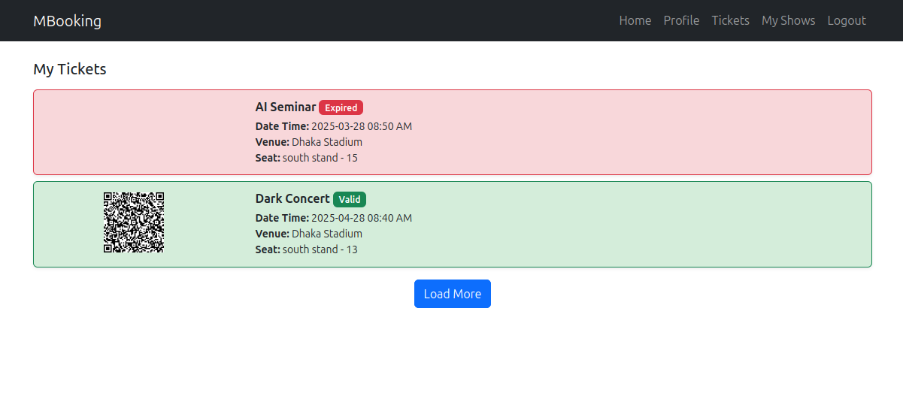

# Ticket Management System

This project is a **C# Ticket Booking System** designed to streamline the process Booking tickets for various Shows.

## Features
- Create, update, and delete tickets.
- Assign tickets to team members.
- Track ticket status and priority.
- Generate reports for ticket analytics.

## Technologies Used
- **C#** for backend development.
- **.NET Framework** for application structure.
- **React** for frontend.
- **SQL Server** for database management.

## Installation
1. Clone the repository:
    ```bash
    git clone https://github.com/your-repo/ticket-management-system.git
    ```
2. Open the project in your preferred IDE (e.g., Visual Studio).
3. Restore NuGet packages.
4. Configure the database connection in `appsettings.json`.
5. Run the application.

## Usage
1. Launch the application.
2. Use the dashboard to create and manage tickets.
3. Assign tickets to team members and track their progress.

## Screenshots
_Add your screenshots here:_




## Contributing
Contributions are welcome! Please fork the repository and submit a pull request.

## License
This project is licensed under the [MIT License](LICENSE).
